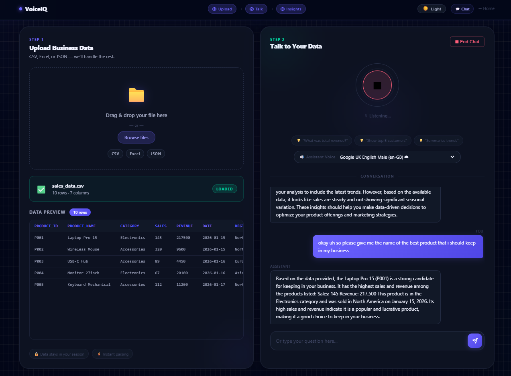
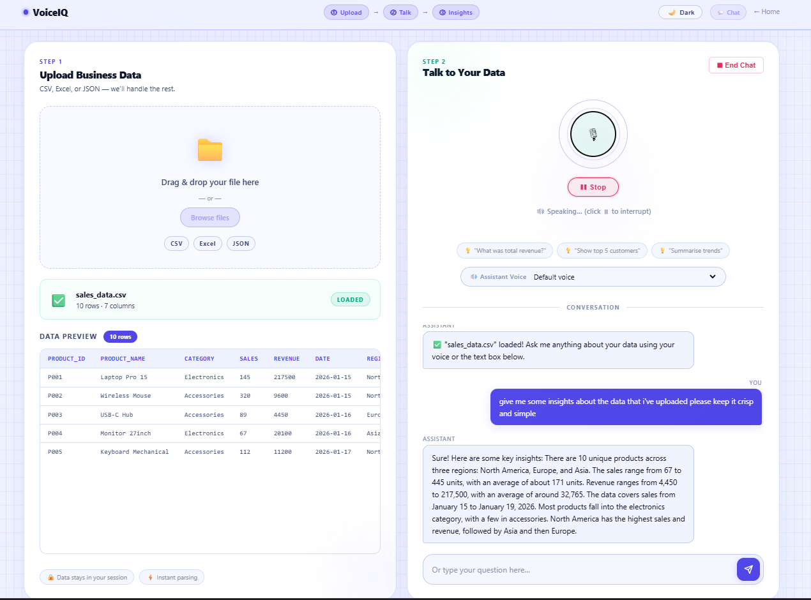

# VoiceIQ

A voice-powered business data analysis assistant. Upload a CSV or Excel file, then ask questions about your data — by voice or text — and get intelligent answers in real time.

---

## Screenshots

| Dark Mode | |
|---|---|
|  |  |

| Light Mode | |
|---|---|
|  |  |

---

## Features

- **Voice input** — speak your question; the app transcribes it automatically
- **Text input** — type queries directly if you prefer
- **File upload** — supports `.csv`, `.xlsx`, and `.xls` files with instant preview
- **AI responses** — LLM answers questions based on your uploaded data
- **Text-to-speech** — replies are read aloud using the browser's speech engine
- **Voice picker** — choose from available system TTS voices
- **Light / Dark mode** — persists across sessions via localStorage
- **WebSocket streaming** — low-latency voice pipeline from mic to response

---

## Tech Stack

| Layer | Technology |
|---|---|
| Backend | Python, FastAPI, Uvicorn |
| STT | HuggingFace Inference API — `openai/whisper-large-v3-turbo` |
| LLM | HuggingFace Inference API — `Qwen/Qwen2.5-7B-Instruct` |
| TTS | Web Speech API (browser-native, zero cost) |
| Frontend | Vanilla HTML, CSS, JavaScript |
| Data Processing | pandas, openpyxl, xlrd |
| Realtime | WebSockets |
| Deployment | Render |

---

## Project Structure

```
├── backend/
│   ├── app/
│   │   ├── main.py          # FastAPI app, routes, StaticFiles mount
│   │   ├── config.py        # Settings via pydantic-settings
│   │   └── routers/         # /api/voice, /api/chat, /api/upload
│   ├── requirements.txt
│   └── start.sh
├── frontend/
│   ├── landing.html         # Landing page
│   ├── index.html           # Main app
│   ├── css/
│   └── js/
├── render.yaml
└── runtime.txt
```

---

## Running Locally

**1. Clone and set up the backend**
```bash
cd backend
python -m venv venv
source venv/bin/activate      # Windows: venv\Scripts\activate
pip install -r requirements.txt
```

**2. Add your HuggingFace token**
```bash
cp .env.example .env
# Edit .env and set HF_API_TOKEN=hf_...
```

**3. Start the server**
```bash
uvicorn app.main:app --reload
```

The app is served at `http://localhost:8000`.

---

## Deployment

Deployed on [Render](https://render.com) as a single web service. The FastAPI backend serves both the API and the frontend static files.

Set the following environment variable in the Render dashboard:

| Key | Value |
|---|---|
| `HF_API_TOKEN` | Your HuggingFace API token |

---

## Created By

**Deepesh Dey**
